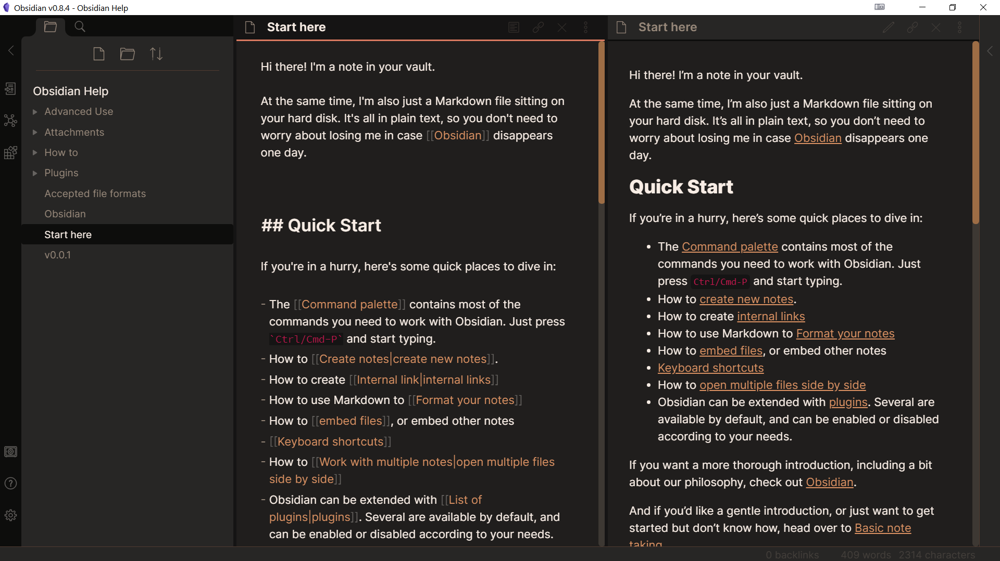
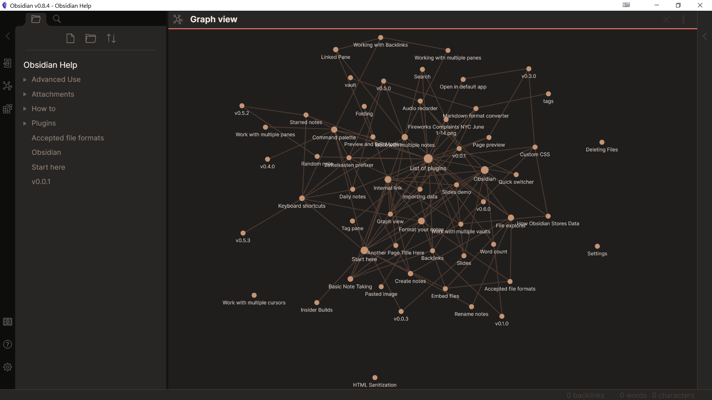

# Magma Theme for Obsidian
A dark theme for Obsidian. Includes a dark UI with a tint of orange, and also a color-changing panel header. Contains a whole lotta orange.

## Screenshots

A screenshot of a note

Graph View Opened Up

## Usage:

1. Open your Obsidian Vault
2. Turn on "Custom CSS, " if you haven't done so already. To do so, click on the gear, then go to "Appearence", and switch on "Custom CSS"
3. Download the file [`obsidian.css`](/obsidian.css), and paste it into your vault folder.
4. Enjoy!

For any advice or problems, you can email me at [`bug@asherhe.com`](mailto:bug@asherhe.com), or [open an issue](https://github.com/asherhe/magma-theme/issues/new)
